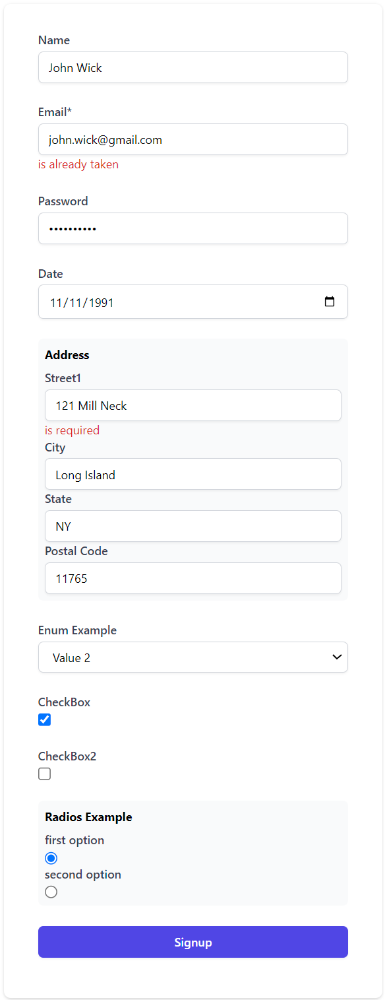

# go-form

Render forms in go based on struct layout, and tags. 

Please note that this package is a pre-alfa release and mainly only a visualization of my initial thought. 
I am also trying to keep the footprint as low as possible without using third party packages.

it can convert to following data: 
```go		
data := struct {
    Form   ExampleForm
    Errors []error
}{
    Form: ExampleForm{
        Name:  "John Wick",
        Email: "john.wick@gmail.com",
        Address: &AddressBlock{
            Street1: "121 Mill Neck",
            City:    "Long Island",
            State:   "NY",
            Zip:     "11765",
        },
        CheckBox:  true,
        CheckBox2: false,
    },
    Errors: []error{
        fieldError{
            Field: "Email",
            Issue: "is already taken",
        },
        fieldError{
            Field: "Address.Street1",
            Issue: "is required",
        },
    },
}
```

into:



Call `form_render` inside the template and pass it the `form struct` and the `errors` : 
```html
<form class="space-y-6" action="#" method="POST">
    {{ form_render .Form .Errors }}
    <div class="flex items-center justify-between">
        <button type="submit" class="flex w-full justify-center rounded-md border border-transparent bg-indigo-600 py-2 px-4 text-sm font-medium text-white shadow-sm hover:bg-indigo-700 focus:outline-none focus:ring-2 focus:ring-indigo-500 focus:ring-offset-2">Signup</button>
    </div>
</form>
```

There is currently only one template file for all the currently supported templates. I'm thinking of making a mini template for each type. 
```html
<div>
    <label {{with .Field.Id}}for="{{.}}"{{end}} class="block text-sm font-medium text-gray-700">{{.Field.Label}}{{ if eq .Field.Required true }}*{{end}}</label>
    <div class="mt-1">
        {{ if eq .Field.Type "dropdown" }}
        <select {{with .Field.Id}}id="{{.}}"{{end}} name="{{.Name}}" class="bg-white block w-full rounded-md border border-gray-300 px-3 py-2 shadow-sm focus:border-indigo-500 focus:outline-none focus:ring-indigo-500 sm:text-sm">
            {{ range $k, $option := .Field.Values }}
            <option value="{{$option.Id}}">{{$option.Name}}</option>
            {{ end }}
        </select>
        {{ else if eq .Type "checkbox" }}
        <input {{with .Field.Id}}id="{{.}}"{{end}} name="{{.Field.Name}}" type="checkbox" {{ if eq .Field.Required true }}required{{end}} {{ if eq .Field.Value true }}checked{{end}} class="w-4 h-4 text-blue-600 bg-gray-100 border-gray-300 rounded focus:ring-blue-500 dark:focus:ring-blue-600 dark:ring-offset-gray-800 focus:ring-2 dark:bg-gray-700 dark:border-gray-600">
        {{ else }}
        <input {{with .Field.Id}}id="{{.}}"{{end}} name="{{.Field.Name}}" placeholder="{{.Field.Placeholder}}" {{with .Field.Value}}value="{{.}}"{{end}} {{ if eq .Field.Required true }}required{{end}} class="block w-full appearance-none rounded-md border border-gray-300 px-3 py-2 placeholder-gray-400 shadow-sm focus:border-indigo-500 focus:outline-none focus:ring-indigo-500 sm:text-sm">
        {{ end }}
        
        {{range errors}}
        <span class="text-sm text-red-600">{{.}}</span>
        {{end}}
    </div>
</div>
```

Groups (nested structs) have their own template 
```html
<div class="mb-4 bg-gray-50 p-2 rounded-md">
  <label class="block text-grey-darker text-sm font-bold mb-2">{{.Name }}</label>
  {{ fields }}
</div>
```

please note that the errors need to implement with the `FieldError` interface. otherwise they will be silently skipped. You can achieve that doing so : 

```go
type fieldError struct {
    Field string
    Issue string
}

func (fe fieldError) Error() string {
    return fmt.Sprintf("%s:%s", fe.Field, fe.Issue)
}

func (fe fieldError) FieldError() (field, err string) {
    return fe.Field, fe.Issue
}
```

supported tags
- label
- placeholder
- name
- required


## TODO 
- better tag handling. maybe group all possible options into one tag or keep it as is. 
- add validation to process the form once posted.